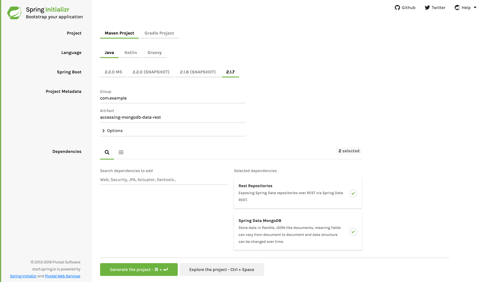

:spring_version: current
:spring_data_rest: current
:spring_data_commons: current
:spring_boot_version: 2.2.1.RELEASE
:Component: http://docs.spring.io/spring/docs/{spring_version}/javadoc-api/org/springframework/stereotype/Component.html
:Controller: http://docs.spring.io/spring/docs/{spring_version}/javadoc-api/org/springframework/stereotype/Controller.html
:DispatcherServlet: http://docs.spring.io/spring/docs/{spring_version}/javadoc-api/org/springframework/web/servlet/DispatcherServlet.html
:SpringApplication: http://docs.spring.io/spring-boot/docs/{spring_boot_version}/api/org/springframework/boot/SpringApplication.html
:ResponseBody: http://docs.spring.io/spring/docs/{spring_version}/javadoc-api/org/springframework/web/bind/annotation/ResponseBody.html
:EnableAutoConfiguration: http://docs.spring.io/spring-boot/docs/{spring_boot_version}/api/org/springframework/boot/autoconfigure/EnableAutoConfiguration.html
:toc:
:icons: font
:source-highlighter: prettify
:project_id: gs-accessing-mongodb-data-rest

This guide walks you through the process of creating an application that accesses
document-based data through a link:/guides/gs/rest-hateoas[hypermedia-based] RESTful front
end.

== What You Will Build

You will build a Spring application that lets you create and retrieve `Person` objects
stored in a https://www.mongodb.org/[MongoDB] NoSQL database by using Spring Data REST.
Spring Data REST takes the features of
https://projects.spring.io/spring-hateoas[Spring HATEOAS] and
https://projects.spring.io/spring-data-mongodb[Spring Data MongoDB] and automatically
combines them together.

NOTE: Spring Data REST also supports link:/guides/gs/accessing-data-rest[Spring Data JPA],
link:/guides/gs/accessing-gemfire-data-rest[Spring Data Gemfire], and
link:/guides/gs/accessing-neo4j-data-rest[Spring Data Neo4j] as backend data stores, but
those are not part of this guide.

== What You need

:java_version: 1.8
include::https://raw.githubusercontent.com/spring-guides/getting-started-macros/master/prereq_editor_jdk_buildtools.adoc[]

include::https://raw.githubusercontent.com/spring-guides/getting-started-macros/master/how_to_complete_this_guide.adoc[]

[[scratch]]
== Starting with Spring Initializr

For all Spring applications, you should start with the https://start.spring.io[Spring
Initializr]. The Initializr offers a fast way to pull in all the dependencies you need for
an application and does a lot of the set up for you. This example needs the Rest
Repositories and Spring Data MongoDB dependencies. The following image shows the
Initializr set up for this sample project:

NOTE: The preceding image shows the Initializr with Maven chosen as the build tool. You
can also use Gradle. It also shows values of `com.example` and
`accessing-mongodb-data-rest` as the Group and Artifact, respectively. You will use those
values throughout the rest of this sample.

The following listing shows the `pom.xml` file created when you choose Maven:

====
[src,xml]
----
include::complete/pom.xml[]
----
====

The following listing shows the `build.gradle` file created when you choose Gradle:

====
[src,groovy]
----
include::complete/build.gradle[]
----
====

[[initial]]
== Install and launch MongoDB

For this guide to work, you must stand up a local MongoDB server.

On a Mac OS X machine with Homebrew installed, run the following command:

====
[src,bash]
----
brew install mongodb
----
====

You can find more installation options at https://docs.mongodb.org/manual/installation/.

After installing MongoDB, you need to launch the `mongo` daemon. On a Mac, you can use
the following command:

====
[src,bash]
----
$ mongod
all output going to: /usr/local/var/log/mongodb/mongo.log
----
====

You can start the MongoDB client from another terminal window by running the `mongo`
command.

== Create a Domain Object

Create a new domain object to present a person, as the following example (in
`src/main/java/com/example/accessingmongodbdatarest/Person.java`) shows:

====
[source,java,tabsize=2]
----
include::complete/src/main/java/com/example/accessingmongodbdatarest/Person.java[]
----
====

The `Person` object has a first name and a last name. (There is also an ID object, which
  is configured to be automatically generated, so need not deal with it.)

== Create a Person Repository

Next, you need to create a simple repository, as the following listing (in
  `src/main/java/com/example/accessingmongodbdatarest/PersonRepository.java`) shows:

====
[source,java,tabsize=2]
----
include::complete/src/main/java/com/example/accessingmongodbdatarest/PersonRepository.java[]
----
====

This repository is an interface and lets you perform various operations that involve
`Person` objects. It gets these operations by extending `MongoRepository`, which in turn
extends the
https://docs.spring.io/spring-data/commons/docs/{spring_data_commons}/api/org/springframework/data/repository/PagingAndSortingRepository.html[`PagingAndSortingRepository`]
interface defined in Spring Data Commons.

At runtime, Spring Data REST automatically creates an implementation of this interface.
Then it uses the
https://docs.spring.io/spring-data/rest/docs/{spring_data_rest}/api/org/springframework/data/rest/core/annotation/RepositoryRestResource.html[@RepositoryRestResource]
annotation to direct Spring MVC to create RESTful endpoints at `/people`.

NOTE: `@RepositoryRestResource` is not required for a repository to be exported. It is
used only to change the export details, such as using `/people` instead of the default
value of `/persons`.

Here you have also defined a custom query to retrieve a list of `Person` objects based on
the `lastName` value. You can see how to invoke it further down in this guide.

NOTE: By default, Spring Boot tries to connect to a locally hosted instance of MongoDB.
Read the
https://docs.spring.io/spring-boot/docs/current/reference/htmlsingle/#boot-features-mongodb[reference docs]
for how to point your application to an instance of MongoDB taht is hosted elsewhere.

include::https://raw.githubusercontent.com/spring-guides/getting-started-macros/master/spring-boot-application-new-path.adoc[]

include::https://raw.githubusercontent.com/spring-guides/getting-started-macros/master/build_an_executable_jar_subhead.adoc[]

include::https://raw.githubusercontent.com/spring-guides/getting-started-macros/master/build_an_executable_jar_with_both.adoc[]

Logging output is displayed. The service should be up and running within a few seconds.

== Test the Application

Now that the application is running, you can test it. You can use any REST client you wish. The following examples use the *nix tool `curl`.

First you want to see the top level service, as the following example shows:

====
[source,bash]
----
$ curl http://localhost:8080
{
  "_links" : {
    "people" : {
      "href" : "http://localhost:8080/people{?page,size,sort}",
      "templated" : true
    }
  }
}
----
====

The preceding example provides a first glimpse of what this server has to offer. There is
a `people` link located at http://localhost:8080/people. It has some options, such as
`?page`, `?size`, and `?sort`.

NOTE: Spring Data REST uses the http://stateless.co/hal_specification.html[HAL format] for
JSON output. It is flexible and offers a convenient way to supply links adjacent to the
data that is served.

When you use the people link, you see the `Person` records in the database (none at
present):

====
[source,bash]
----
$ curl http://localhost:8080/people
{
  "_links" : {
    "self" : {
      "href" : "http://localhost:8080/people{?page,size,sort}",
      "templated" : true
    },
    "search" : {
      "href" : "http://localhost:8080/people/search"
    }
  },
  "page" : {
    "size" : 20,
    "totalElements" : 0,
    "totalPages" : 0,
    "number" : 0
  }
}
----
====

There are currently no elements and, hence, no pages. It is time to create a new `Person`!

NOTE: If you run this guide multiple times, there may be leftover data. Refer to the
https://docs.mongodb.org/manual/reference/mongo-shell/[MongoDB shell quick reference] for
commands to find and drop your database if you need a fresh start.

The following command creats a person named "`Frodo Baggins`":

====
[source,bash]
----
$ curl -i -X POST -H "Content-Type:application/json" -d "{  \"firstName\" : \"Frodo\",  \"lastName\" : \"Baggins\" }" http://localhost:8080/people
HTTP/1.1 201 Created
Server: Apache-Coyote/1.1
Location: http://localhost:8080/people/53149b8e3004990b1af9f229
Content-Length: 0
Date: Mon, 03 Mar 2014 15:08:46 GMT
----

- `-i`: Ensures you can see the response message including the headers. The URI of the
newly created `Person` is shown.
- `-X POST`: Signals this a `POST` used to create a new entry.
- `-H "Content-Type:application/json"`: Sets the content type so the application knows the
payload contains a JSON object.
- `-d '{  "firstName" : "Frodo",  "lastName" : "Baggins" }'`: Is the data being sent.
====

NOTE: Notice how the previous `POST` operation includes a `Location` header. This contains
the URI of the newly created resource. Spring Data REST also has two methods
(`RepositoryRestConfiguration.setReturnBodyOnCreate(…)` and `setReturnBodyOnUpdate(…)`)
that you can use to configure the framework to immediately return the representation of
the resource just created/updated.

From this you can query for all people, as the following example shows:

====
[source,bash]
----
$ curl http://localhost:8080/people
{
  "_links" : {
    "self" : {
      "href" : "http://localhost:8080/people{?page,size,sort}",
      "templated" : true
    },
    "search" : {
      "href" : "http://localhost:8080/people/search"
    }
  },
  "_embedded" : {
    "persons" : [ {
      "firstName" : "Frodo",
      "lastName" : "Baggins",
      "_links" : {
        "self" : {
          "href" : "http://localhost:8080/people/53149b8e3004990b1af9f229"
        }
      }
    } ]
  },
  "page" : {
    "size" : 20,
    "totalElements" : 1,
    "totalPages" : 1,
    "number" : 0
  }
}
----
====

The `persons` object contains a list with Frodo. Notice how it includes a `self` link.
Spring Data REST also uses the
https://www.atteo.org/2011/12/12/Evo-Inflector.html[Evo Inflector] to pluralize the names
of entities for groupings.

You can directly query for the individual record, as the following example shows:

====
[source,bash]
----
$ curl http://localhost:8080/people/53149b8e3004990b1af9f229
{
  "firstName" : "Frodo",
  "lastName" : "Baggins",
  "_links" : {
    "self" : {
      "href" : "http://localhost:8080/people/53149b8e3004990b1af9f229"
    }
  }
}
----
====

NOTE: This might appear to be purely web-based, but, behind the scenes, it is talking to
the MongoDB database you started.

In this guide, there is only one domain object. With a more complex system, where domain
objects are related to each other, Spring Data REST renders additional links to help
navigate to connected records.

Find all the custom queries, as the following example shows:

====
[source,bash]
----
$ curl http://localhost:8080/people/search
{
  "_links" : {
    "findByLastName" : {
      "href" : "http://localhost:8080/people/search/findByLastName{?name}",
      "templated" : true
    }
  }
}
----
====

You can see the URL for the query, including the HTTP query parameter, `name`. This
matches the `@Param("name")` annotation embedded in the interface.

To use the `findByLastName` query, run the following  command:

====
[source,bash]
----
$ curl http://localhost:8080/people/search/findByLastName?name=Baggins
{
  "_embedded" : {
    "persons" : [ {
      "firstName" : "Frodo",
      "lastName" : "Baggins",
      "_links" : {
        "self" : {
          "href" : "http://localhost:8080/people/53149b8e3004990b1af9f229"
        }
      }
    } ]
  }
}
----
====

Because you defined it to return `List<Person>` in the code, it returns all of the
results. If you had defined it to return only `Person`, it picks one of the `Person`
objects to return. Since this can be unpredictable, you probably do not want to do that
for queries that can return multiple entries.

You can also issue `PUT`, `PATCH`, and `DELETE` REST calls to replace, update, or delete
existing records, respectively. The following example uses a `PUT` call:

====
[source,bash]
----
$ curl -X PUT -H "Content-Type:application/json" -d "{ \"firstName\": \"Bilbo\", \"lastName\": \"Baggins\" }" http://localhost:8080/people/53149b8e3004990b1af9f229
$ curl http://localhost:8080/people/53149b8e3004990b1af9f229
{
  "firstName" : "Bilbo",
  "lastName" : "Baggins",
  "_links" : {
    "self" : {
      "href" : "http://localhost:8080/people/53149b8e3004990b1af9f229"
    }
  }
}
----
====

The following example uses a `PATCH` call:

====
[source,bash]
----
$ curl -X PATCH -H "Content-Type:application/json" -d "{ \"firstName\": \"Bilbo Jr.\" }" http://localhost:8080/people/53149b8e3004990b1af9f229
$ curl http://localhost:8080/people/53149b8e3004990b1af9f229
{
  "firstName" : "Bilbo Jr.",
  "lastName" : "Baggins",
  "_links" : {
    "self" : {
      "href" : "http://localhost:8080/people/53149b8e3004990b1af9f229"
    }
  }
}
----
====

NOTE: `PUT` replaces an entire record. Fields not supplied will be replaced with `null`.
You can use `PATCH` to update a subset of items.

You can also delete records, as the following example shows:

====
[source,bash]
----
$ curl -X DELETE http://localhost:8080/people/53149b8e3004990b1af9f229
$ curl http://localhost:8080/people
{
  "_links" : {
    "self" : {
      "href" : "http://localhost:8080/people{?page,size,sort}",
      "templated" : true
    },
    "search" : {
      "href" : "http://localhost:8080/people/search"
    }
  },
  "page" : {
    "size" : 20,
    "totalElements" : 0,
    "totalPages" : 0,
    "number" : 0
  }
}
----
====

A convenient aspect of this link:/understanding/HATEOAS[hypermedia-driven interface] is
how you can discover all the RESTful endpoints by using curl (or whatever REST client you
  like). There is no need to exchange a formal contract or interface document with your
  customers.

== Summary

Congratulations! You have just developed an application with a
link:/guides/gs/rest-hateoas[hypermedia-based] REST front end and a MongoDB-based back
end.

== See Also

The following guides may also be helpful:

* https://spring.io/guides/gs/accessing-data-rest/[Accessing JPA Data with REST]
* https://spring.io/guides/gs/accessing-gemfire-data-rest/[Accessing Gemfire Data with REST]
* https://spring.io/guides/gs/accessing-data-mysql/[Accessing data with MySQL]
* https://spring.io/guides/gs/accessing-neo4j-data-rest/[Accessing Neo4j Data with REST]
* https://spring.io/guides/gs/consuming-rest/[Consuming a RESTful Web Service]
* https://spring.io/guides/gs/consuming-rest-angularjs/[Consuming a RESTful Web Service with AngularJS]
* https://spring.io/guides/gs/consuming-rest-jquery/[Consuming a RESTful Web Service with jQuery]
* https://spring.io/guides/gs/consuming-rest-restjs/[Consuming a RESTful Web Service with rest.js]
* https://spring.io/guides/gs/securing-web/[Securing a Web Application]
* https://spring.io/guides/tutorials/bookmarks/[Building REST services with Spring]
* https://spring.io/guides/gs/spring-boot/[Building an Application with Spring Boot]
* https://spring.io/guides/gs/testing-restdocs/[Creating API Documentation with Restdocs]
* https://spring.io/guides/gs/rest-service-cors/[Enabling Cross Origin Requests for a RESTful Web Service]
* https://spring.io/guides/gs/rest-hateoas/[Building a Hypermedia-Driven RESTful Web Service]

include::https://raw.githubusercontent.com/spring-guides/getting-started-macros/master/footer.adoc[]
